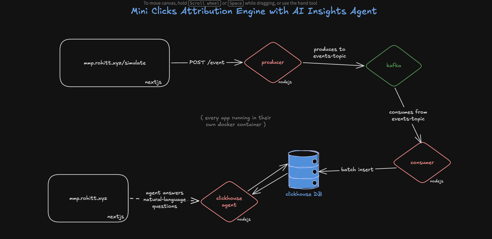

# Mini Click-Attribution Engine with AI Insights Agent

A small event-analytics pipeline: clients POST click/page events, they flow through Kafka into ClickHouse, and an AI agent answers natural-language questions about the data.

```
producer         Fastify API that accepts events over HTTP and publishes them to Kafka
consumer         Consumes events from Kafka and batch-inserts them into ClickHouse
clickhouse       Init SQL that creates the `events` table on first boot
clickhouse-agent Fastify API (/ask) — an LLM agent with SQL tool-calling over ClickHouse,
                 answering natural-language questions about the event data
web-app          Next.js UI: simulate events, chat with the insights agent, and view
                 service health/logs
```

## Data flow

```
client → producer (/event) → Kafka (events-topic) → consumer → ClickHouse (mydb.events)
                                                                       ↑
                                              clickhouse-agent (/ask) queries it,
                                              surfaced through web-app's chat UI
```

## Running locally

```bash
docker compose up --build
```

This brings up Kafka (+ kafka-ui), ClickHouse, and all four app services with health checks wired between them.

| Service          | URL                     | Notes                                  |
| ----------------- | ----------------------- | --------------------------------------- |
| web-app           | http://localhost:3000   | Chat, event simulator, logs/health page |
| producer          | http://localhost:8001   | `POST /event`                           |
| consumer          | http://localhost:8002   | health check only, no public API        |
| clickhouse-agent  | http://localhost:3030   | `GET /ask?query=...`, `POST /sql`       |
| clickhouse        | http://localhost:8123   | HTTP interface, db `mydb`               |
| kafka-ui          | http://localhost:8080   | inspect the `events-topic`              |

`clickhouse-agent` needs an `OPENAI_API_KEY` in `clickhouse-agent/.env`. `producer` and `consumer` each need their own `.env` (see the `env_file` entries in [docker-compose.yml](docker-compose.yml) for the variables docker-compose overrides/expects).

## Services

- **producer** — `POST /event` with an event payload; publishes it as-is to the `events-topic` Kafka topic.
- **consumer** — subscribes to `events-topic`, buffers messages in memory, and flushes batches into ClickHouse's `mydb.events` table (see [clickhouse/init/001-events.sql](clickhouse/init/001-events.sql) for the schema).
- **clickhouse-agent** — exposes:
  - `GET /ask?query=...` — ask a question in natural language; add `stream=true` (or `Accept: text/event-stream`) for a token/tool-call SSE stream instead of a single JSON response.
  - `POST /sql` — run a read-only, guarded SQL query directly against ClickHouse.
- **web-app** — Next.js frontend with a chat UI over `/ask`, an event simulator that hits the producer, and a logs/health page that reads container status via the Docker Engine API.

## Development (per service)

Each Node service uses `pnpm`:

```bash
cd producer   # or consumer / clickhouse-agent
pnpm install
pnpm dev      # tsx watch, loads .env
```

`web-app` is a standard Next.js app (`pnpm install && pnpm dev`).
